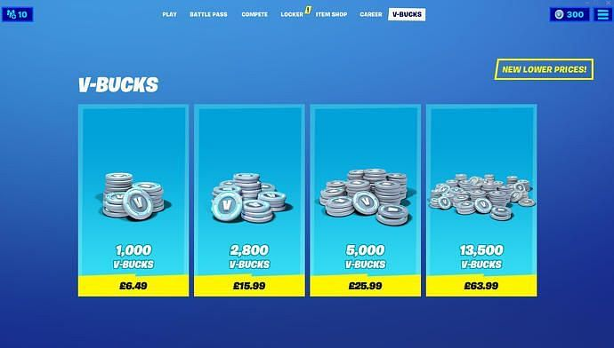
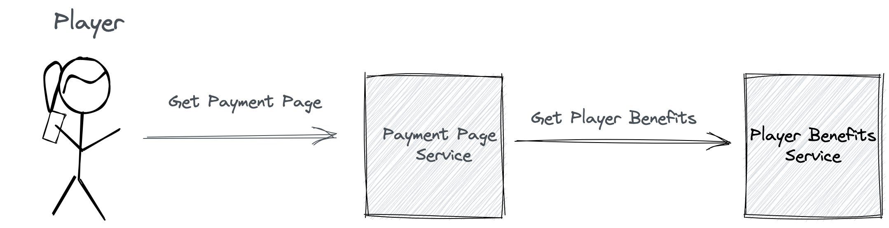

# Microservices playground

### Every modern online game provides in-game purchases:

### In this playground, you will learn how to create microservices that will provide the player with dynamic coins amount and price data available on the payment page based on the player's benefits.

